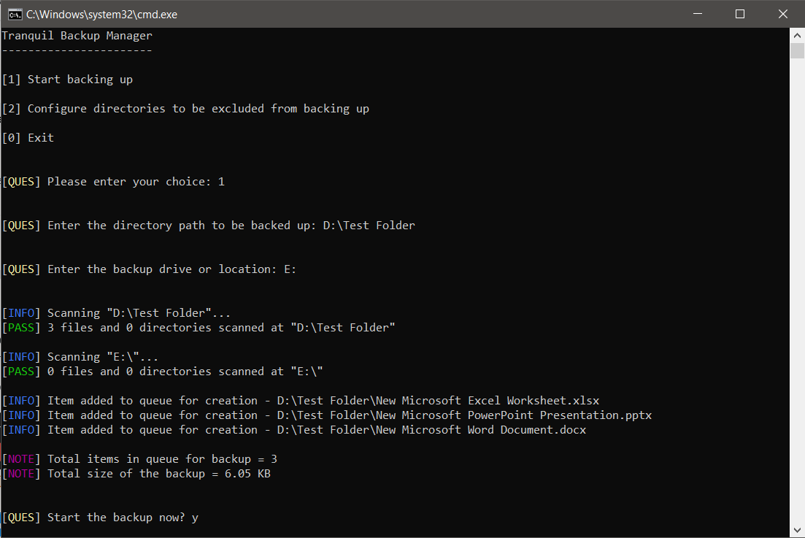
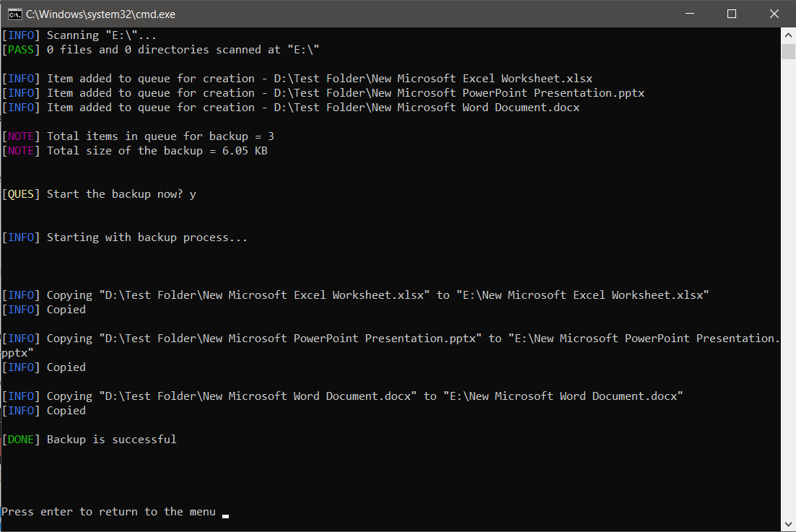
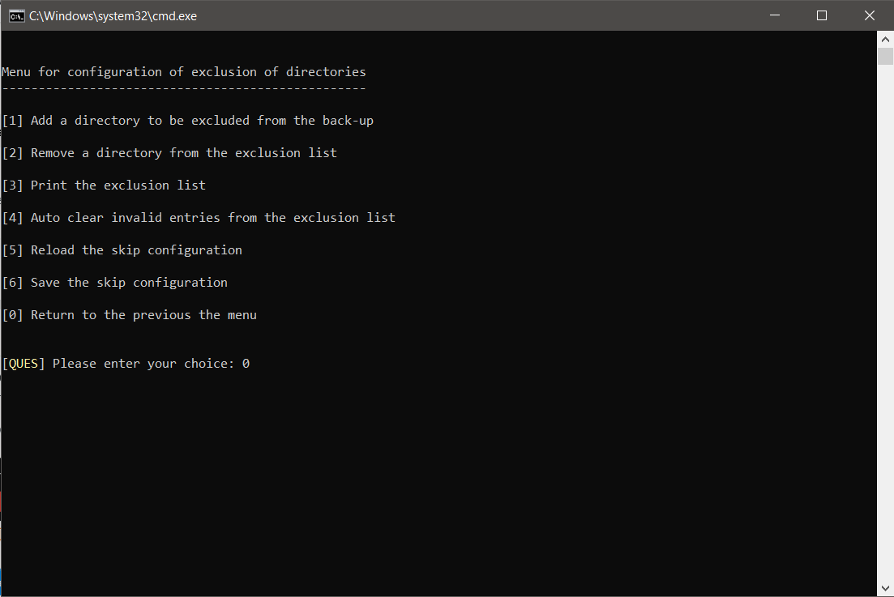

# Tranquil Backup

A data backup tool for making full or differential backups to and from physically connected disk drives or partitions


## Features

+ Only copy the new or updated files or directories, saving time and manual efforts
+ Preserve the metadata of each of the file and directory during backup process
+ Easily skip the child-directories that you don't want to backup
+ Before starting the backup, Tranquil shows number of items ready for backup and the total backup size


## Dependencies

+ JDK version 11.0.11 or above


## How to run

1. Clone the repository on your machine

2. If you are using Windows OS, simply double on the [`run.cmd`](run.cmd) file. If you are using unix based OS, run the below command in the project directory
   ```bash
   $ ./run.sh
   ```


## Screenshots

+ Program Menu and prompts

   

+ Backup messages

   

+ Menu for excluding child directories from the backup process

   
